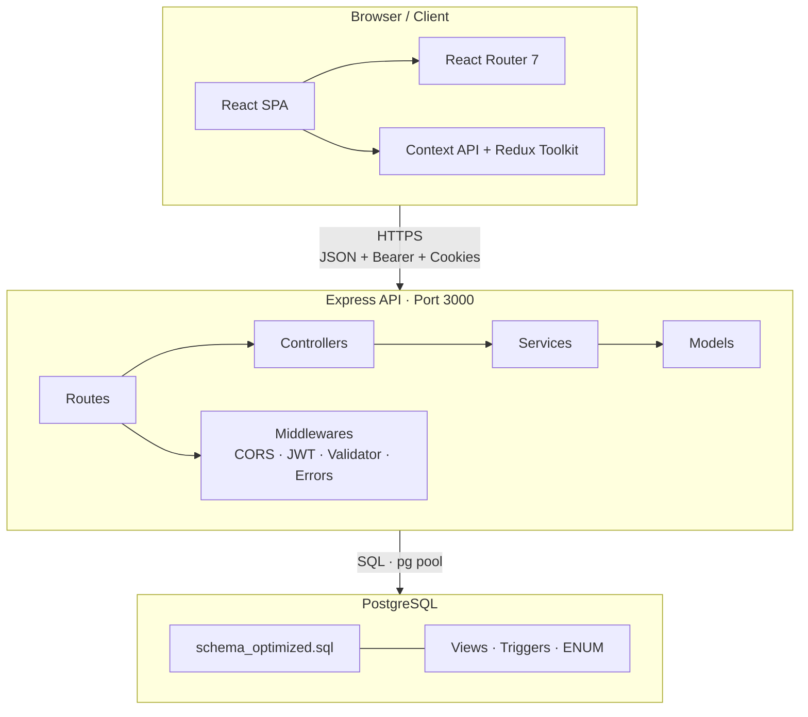
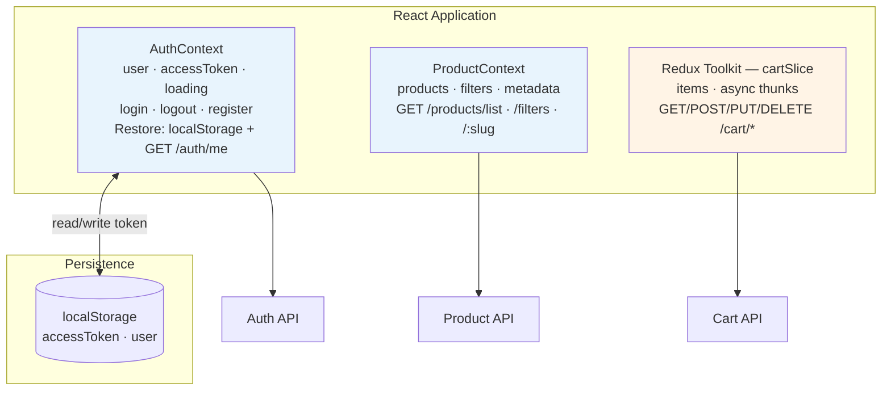
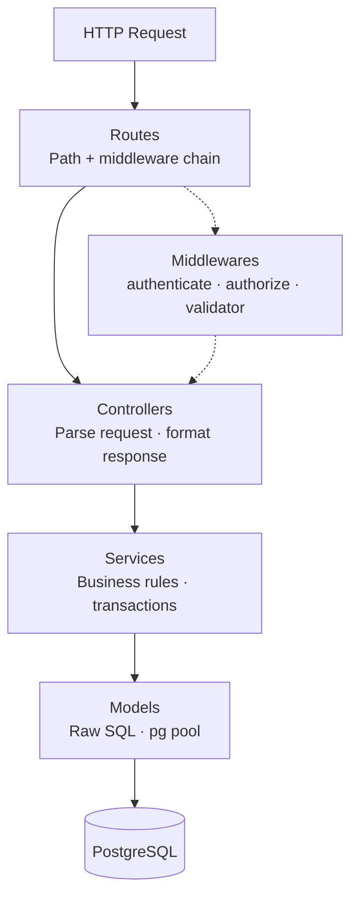
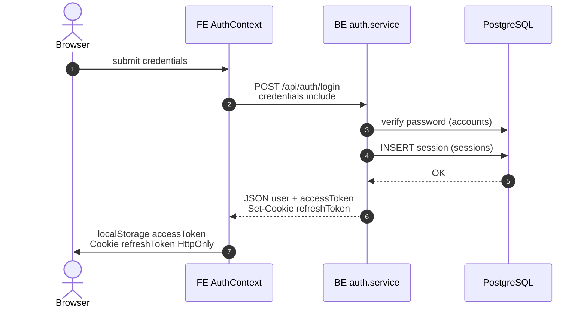
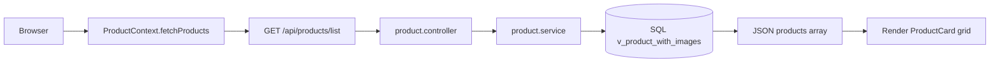
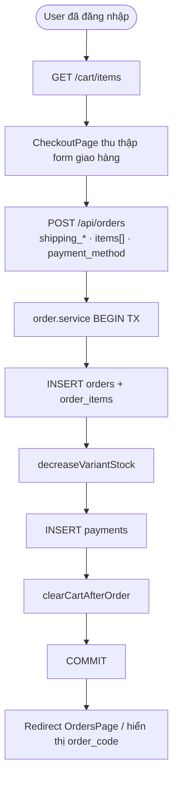
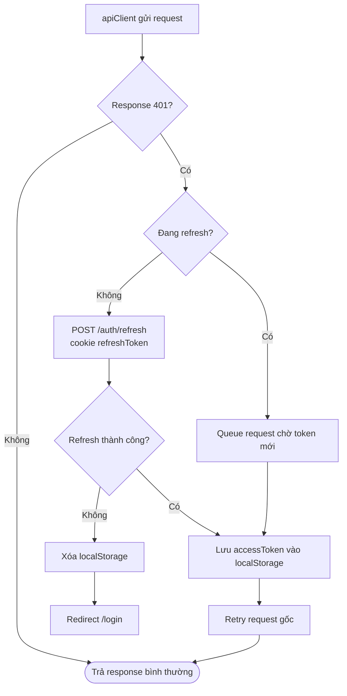

# Architecture — Web Bán Quần Áo

| Thuộc tính | Giá trị |
|------------|---------|
| **Stack FE** | React 19 + Vite 7 |
| **Stack BE** | Express 5 + PostgreSQL |
| **Deploy FE** | Vercel |
| **Deploy BE** | Render |
| **Cập nhật** | 2026-05-19 |

> Tài liệu mô tả kiến trúc runtime và luồng nghiệp vụ. Sơ đồ dùng [Mermaid](https://mermaid.js.org/) — xem được trên GitHub và VS Code Markdown Preview.

---

## 1. System Overview

---

## 2. Cấu trúc monorepo

| Thư mục | Mô tả |
|---------|--------|
| `FE/` | Frontend Vite + React (`pages/`, `components/`, `context/`, `redux/`, `services/`) |
| `BE/` | Backend Express (`server.js`, `src/routes`, `controller`, `services`, `model`, `middlewares`) |
| `docs/` | Tài liệu dự án (repo root) |

**Entry points:** `FE/src/main.jsx` · `BE/server.js`  
**Schema DB:** `BE/src/database/schema_optimized.sql`

---

## 3. Frontend

### 3.1 Pages & routing

| Path | Component | Auth | Mô tả |
|:-----|:----------|:-----|:------|
| `/` | `HomePage` | Public | Trang chủ |
| `/products` | `ProductPage` | Public | Danh sách sản phẩm |
| `/products/:slug` | `ProductDetail` | Public | Chi tiết sản phẩm |
| `/search` | `SearchPage` | Public | Tìm kiếm + bộ lọc |
| `/cart` | `CartPage` | Public* | Giỏ hàng (*API cart cần đăng nhập) |
| `/checkout` | `CheckoutPage` | Protected | Thanh toán |
| `/orders` | `OrdersPage` | Protected | Lịch sử đơn hàng |
| `/my` | `MyPage` | Protected | Hồ sơ cá nhân |
| `/login` | `LoginPage` | Public | Đăng nhập / đăng ký |
| `/about-us` | `AboutUsPage` | Public | Giới thiệu |

- **Router:** `BrowserRouter` trong `App.jsx`
- **Protected routes:** `ProtectedRoute` → redirect `/login` nếu chưa xác thực

### 3.2 Components chính

| Component | Vai trò |
|:----------|:--------|
| `Header` / `Footer` | Layout, điều hướng, badge giỏ hàng |
| `ProductCard` | Card sản phẩm trên lưới |
| `SearchFiltersPanel` / `FilterSection` | Bộ lọc tìm kiếm |
| `ProductGridSkeleton` | Skeleton loading |
| `ScrollToTop` | Cuộn lên đầu khi đổi route |
| `TextType` | Hiệu ứng typing (homepage) |

### 3.3 State Management

**Pattern:** Context cho domain lớn (auth, catalog); Redux cho luồng giỏ hàng bất đồng bộ.

### 3.4 Services

| File | Chức năng |
|:-----|:----------|
| `apiClient.js` | Axios + interceptors: Bearer header, auto-refresh khi `401` |
| `authService.js` | `login` / `register` / `logout` / `me` |

**Base URL:** `https://web-ban-quan-ao-9s0d.onrender.com/api`

### 3.5 Styling & UX

- **Tailwind CSS v4** — `@tailwindcss/vite`
- **CSS Modules** — `*.module.css` theo page/component
- **AOS** — animation homepage
- **Font Awesome** — icons

---

## 4. Backend

### 4.1 Backend Layered Architecture

### 4.2 Routes map

| Prefix | File | Controller |
|:-------|:-----|:-----------|
| `/api/auth` | `auth.routes.js` | `auth.controller.js` |
| `/api/users` | `user.routes.js` | `user.controller.js` |
| `/api/account` | `account.routes.js` | `account.controller.js` |
| `/api/products` | `product.routes.js` | `product.controller.js` |
| `/api/cart` | `cart.routes.js` | `cart.controller.js` |
| `/api/orders` | `order.routes.js` | `order.controller.js` |

### 4.3 Services & models

| Domain | Service | Model |
|:-------|:--------|:------|
| Auth | `auth.service.js` | `user`, `account`, `session` |
| Products | `product.service.js` | `product.model.js` |
| Cart | `cart.service.js` | `cart.model.js` |
| Orders | `order.service.js` | `order.model.js` |
| Account | `account.service.js` | `account.model.js` |
| Users | `user.service.js` | `user.model.js` |

### 4.4 Middlewares

| Middleware | File | Vai trò |
|:-----------|:-----|:--------|
| `authenticate` | `authMiddleware.js` | JWT Bearer → `req.user` |
| `authorize(...roles)` | `authMiddleware.js` | RBAC theo role |
| `optionalAuth` | `authMiddleware.js` | Public route + enrich user nếu có token |
| `registerValidation` … | `auth.validator.js` | `express-validator` |
| `errorHandler` | `errorHandler.js` | Chuẩn hóa lỗi + `requestId` |
| CORS | `config/cors.js` | Whitelist origin FE |

### 4.5 Config

| File | Biến môi trường |
|:-----|:----------------|
| `config/db.js` | `DATABASE_URL` |
| `config/jwt.js` | `JWT_SECRET_KEY`, `JWT_REFRESH_KEY` |
| `config/index.js` | Tập hợp cấu hình |

---

## 5. Database layer

| Thành phần | Chi tiết |
|:-----------|:---------|
| ORM | Không — raw SQL trong models |
| Schema | `BE/src/database/schema_optimized.sql` |
| Views | `v_product_detail`, `v_order_summary`, … |
| Triggers | stock, rating, voucher, `updated_at` |

Quan hệ bảng: xem [ERD.md](./ERD.md)

---

## 6. Data flow

### 6.1 Login (sequence)

### 6.2 Xem & lọc sản phẩm

### 6.3 Checkout

### 6.4 Auto refresh token

---

## 7. Request flow — Thêm vào giỏ

| Bước | Layer | Hành động |
|:----:|:------|:----------|
| 1 | UI | User bấm **Thêm giỏ** trên `ProductDetail` |
| 2 | FE | `POST /cart/add-item` + `Authorization: Bearer` |
| 3 | BE Route | `cart.routes.js` → middleware `authenticate` |
| 4 | Controller | `CartController.addItemAddToCart` |
| 5 | Service | `addItemAddToCartForUser(user_id, variant_id, qty)` |
| 6 | Model | UPSERT `cart_items`, đảm bảo `carts` tồn tại |
| 7 | DB | UNIQUE `(cart_id, variant_id)` → tăng `quantity` nếu trùng |
| 8 | Response | `201` + JSON cart item |
| 9 | FE | Cập nhật Redux / Context + badge Header |

---

## 8. Module responsibilities

| Module | Trách nhiệm | Không làm |
|:-------|:------------|:----------|
| **FE Pages** | Compose UI, gọi API, form state cục bộ | SQL, business rules |
| **FE Context / Redux** | Shared state, cache nhẹ | HTTP chi tiết (ủy quyền services) |
| **BE Controller** | HTTP status, shape response | SQL phức tạp |
| **BE Service** | Validation nghiệp vụ, transactions | Đọc `req.body` rải rác |
| **BE Model** | Query, map rows | Authorization |
| **PostgreSQL** | Integrity, triggers, constraints | UI logic |

---

## 9. Security highlights

| Chủ đề | Triển khai |
|:-------|:-----------|
| Password | bcrypt → `accounts.password_hash` |
| Access token | JWT, header `Bearer` |
| Refresh token | HTTP-only cookie + bảng `sessions` |
| XSS | `escape()` trong express-validator |
| CORS | Whitelist origin FE |
| RBAC | `authorize()` — chưa gắn đủ route admin |

---

## 10. Deployment & environments

| Môi trường | Frontend | Backend |
|:-----------|:---------|:--------|
| **Dev** | `npm run dev` (Vite `:5173`) | `node server.js` (`:3000`) |
| **Prod** | Vercel static build | Render Node service |

> **Cross-origin:** Cookie `SameSite=None` + `Secure` trên production.

---

## 11. Gợi ý kiến trúc (review)

- [ ] Tách `productService.js`, `orderService.js` — thay `fetch` rải rác trong pages
- [ ] Guest cart: `optionalAuth` + header `session_id` khớp schema
- [ ] Admin panel tách module / app con
- [ ] Testing: Supertest (BE), Vitest + MSW (FE)
- [ ] SEO: Vite SSR hoặc migrate catalog sang Next.js (Sprint 5)

---

## 12. Tech dependencies

| Layer | Packages |
|:------|:---------|
| **FE** | react, react-router-dom, @reduxjs/toolkit, axios, tailwindcss, aos |
| **BE** | express, pg, jsonwebtoken, bcrypt, cookie-parser, cors, express-validator, dotenv |
