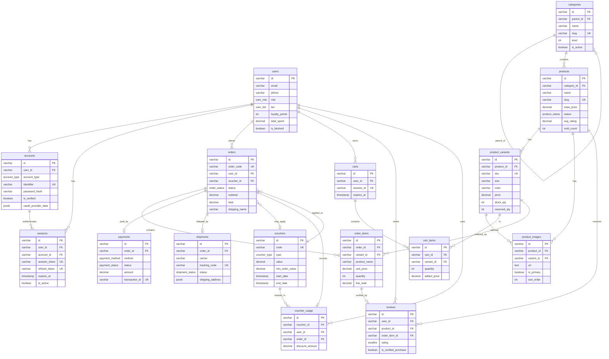
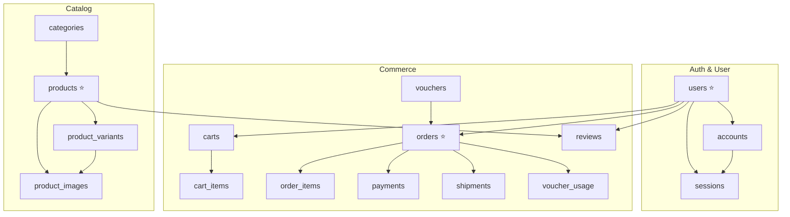

# ERD / Data Schema — Web Bán Quần Áo

| Thuộc tính | Giá trị |
|------------|---------|
| **Nguồn** | `BE/src/database/schema_optimized.sql` |
| **Database** | PostgreSQL 14+ |
| **Version** | 2.0 |
| **Cập nhật** | 2026-05-19 |

> Schema tách **profile** (`users`) và **xác thực** (`accounts`), session JWT lưu DB, catalog đa biến thể, đơn hàng snapshot, giỏ hàng hỗ trợ guest (`session_id`).

**Bảng core:** `users` · `products` · `orders` (đánh dấu trong sơ đồ ER)

---

## Sơ đồ quan hệ (ER Diagram)

### Nhóm quan hệ theo domain

> **Bảng phụ trong schema (ngoài sơ đồ ER chính):** `addresses`, `return_requests`

---

## Custom ENUM Types

| Type | Values |
|:-----|:-------|
| `user_role` | `customer`, `admin`, `staff`, `super_admin` |
| `user_tier` | `normal`, `silver`, `gold`, `platinum`, `vip` |
| `account_type` | `email`, `phone`, `oauth_google`, `oauth_facebook`, `oauth_apple` |
| `product_status` | `draft`, `active`, `archived`, `out_of_stock` |
| `order_status` | `pending`, `confirmed`, `packing`, `shipped`, `delivered`, `completed`, `cancelled`, `refunded` |
| `payment_method` | `cod`, `vnpay`, `momo`, `zalopay`, `bank_transfer`, `credit_card`, `debit_card` |
| `payment_status` | `pending`, `paid`, `failed`, `refunded`, `partially_refunded` |
| `shipment_status` | `preparing`, `picked_up`, `in_transit`, `out_for_delivery`, `delivered`, `returned`, `failed` |
| `voucher_type` | `percent`, `fixed`, `free_ship` |
| `return_status` | `pending`, `approved`, `rejected`, `processing`, `refunded`, `completed` |

---

## Chi tiết bảng

### `users` — Hồ sơ & dữ liệu kinh doanh

| Field | Type | PK | FK | Default | Note |
|:------|:-----|:--:|:--:|:--------|:-----|
| `id` | VARCHAR(50) | ✓ | | — | ID dạng string (`usr_xxx`) |
| `full_name` | VARCHAR(100) | | | NULL | |
| `first_name` | VARCHAR(100) | | | NULL | |
| `last_name` | VARCHAR(100) | | | NULL | |
| `avatar_url` | TEXT | | | NULL | |
| `date_of_birth` | DATE | | | NULL | |
| `gender` | VARCHAR(10) | | | NULL | |
| `email` | VARCHAR(150) | | | NULL | CHECK: email **hoặc** phone |
| `phone` | VARCHAR(15) | | | NULL | |
| `country` | VARCHAR(100) | | | NULL | |
| `state` | VARCHAR(100) | | | NULL | |
| `address` | TEXT | | | NULL | Khác bảng `addresses` |
| `city` | VARCHAR(100) | | | NULL | |
| `postal_code` | VARCHAR(20) | | | NULL | |
| `role` | user_role | | | `customer` | |
| `tier` | user_tier | | | `normal` | Hạng loyalty |
| `loyalty_points` | INT | | | `0` | CHECK ≥ 0 |
| `total_spent` | DECIMAL(15,2) | | | `0` | Khi order `completed` |
| `total_orders` | INT | | | `0` | |
| `is_active` | BOOLEAN | | | `TRUE` | |
| `is_verified` | BOOLEAN | | | `FALSE` | |
| `is_blocked` | BOOLEAN | | | `FALSE` | |
| `created_at` | TIMESTAMP | | | `CURRENT_TIMESTAMP` | |
| `updated_at` | TIMESTAMP | | | `CURRENT_TIMESTAMP` | Auto trigger |

---

### `accounts` — Xác thực (email / phone / OAuth)

| Field | Type | PK | FK | Default | Note |
|:------|:-----|:--:|:--:|:--------|:-----|
| `id` | VARCHAR(50) | ✓ | | — | |
| `user_id` | VARCHAR(50) | | ✓ → `users.id` CASCADE | — | |
| `account_type` | account_type | | | — | |
| `identifier` | VARCHAR(255) | | | — | Email / SĐT / OAuth subject |
| `password_hash` | VARCHAR(255) | | | NULL | NULL với OAuth |
| `is_verified` | BOOLEAN | | | `FALSE` | |
| `verification_token` | VARCHAR(255) | | | NULL | |
| `verification_token_expires_at` | TIMESTAMP | | | NULL | |
| `verified_at` | TIMESTAMP | | | NULL | |
| `reset_token` | VARCHAR(255) | | | NULL | Forgot password |
| `reset_token_expires_at` | TIMESTAMP | | | NULL | |
| `oauth_access_token` | TEXT | | | NULL | |
| `oauth_refresh_token` | TEXT | | | NULL | |
| `oauth_provider_data` | JSONB | | | NULL | `{name, email, avatar_url}` |
| `failed_login_attempts` | INT | | | `0` | |
| `locked_until` | TIMESTAMP | | | NULL | Khóa tạm |
| `last_login_at` | TIMESTAMP | | | NULL | |
| `last_login_ip` | VARCHAR(45) | | | NULL | |
| `created_at` | TIMESTAMP | | | `CURRENT_TIMESTAMP` | |
| `updated_at` | TIMESTAMP | | | `CURRENT_TIMESTAMP` | |

**Ràng buộc:** `UNIQUE (account_type, identifier)`

---

### `sessions` — Phiên đăng nhập

| Field | Type | PK | FK | Default | Note |
|:------|:-----|:--:|:--:|:--------|:-----|
| `id` | VARCHAR(50) | ✓ | | — | |
| `user_id` | VARCHAR(50) | | ✓ → `users.id` CASCADE | — | |
| `account_id` | VARCHAR(50) | | ✓ → `accounts.id` CASCADE | — | |
| `session_token` | VARCHAR(500) | | | — | UNIQUE · map JWT access |
| `refresh_token` | VARCHAR(500) | | | NULL | UNIQUE · HTTP-only cookie |
| `device_type` | VARCHAR(50) | | | NULL | |
| `ip_address` | VARCHAR(45) | | | NULL | |
| `user_agent` | TEXT | | | NULL | |
| `is_active` | BOOLEAN | | | `TRUE` | |
| `expires_at` | TIMESTAMP | | | — | Bắt buộc |
| `created_at` | TIMESTAMP | | | `CURRENT_TIMESTAMP` | |
| `last_activity_at` | TIMESTAMP | | | `CURRENT_TIMESTAMP` | |

---

### `products` — Sản phẩm

| Field | Type | PK | FK | Default | Note |
|:------|:-----|:--:|:--:|:--------|:-----|
| `id` | VARCHAR(50) | ✓ | | — | |
| `category_id` | VARCHAR(50) | | ✓ → `categories.id` RESTRICT | — | |
| `name` | VARCHAR(255) | | | — | |
| `slug` | VARCHAR(300) | | | — | UNIQUE · URL FE |
| `sku` | VARCHAR(100) | | | NULL | UNIQUE |
| `short_description` | VARCHAR(500) | | | NULL | |
| `description` | TEXT | | | NULL | |
| `brand` | VARCHAR(100) | | | NULL | Filter search |
| `base_price` | DECIMAL(12,2) | | | — | CHECK ≥ 0 |
| `original_price` | DECIMAL(12,2) | | | NULL | |
| `is_sale` | BOOLEAN | | | `FALSE` | |
| `discount_percent` | DECIMAL(5,2) | | | `0` | 0–100 |
| `requires_shipping` | BOOLEAN | | | `TRUE` | |
| `weight_grams` | INT | | | NULL | |
| `view_count` | INT | | | `0` | |
| `sold_count` | INT | | | `0` | Trigger order completed |
| `avg_rating` | DECIMAL(3,2) | | | `0.0` | Auto từ `reviews` |
| `review_count` | INT | | | `0` | |
| `status` | product_status | | | `draft` | API list: `active` |
| `is_featured` | BOOLEAN | | | `FALSE` | |
| `is_new` | BOOLEAN | | | `FALSE` | |
| `is_bestseller` | BOOLEAN | | | `FALSE` | |
| `published_at` | TIMESTAMP | | | NULL | |
| `meta_title` | VARCHAR(200) | | | NULL | SEO |
| `meta_description` | VARCHAR(300) | | | NULL | |
| `meta_keywords` | TEXT | | | NULL | |
| `created_at` | TIMESTAMP | | | `CURRENT_TIMESTAMP` | |
| `updated_at` | TIMESTAMP | | | `CURRENT_TIMESTAMP` | |

**Views:** `v_product_with_images`, `v_product_detail`, `v_variant_with_images`

---

### `product_variants` — Biến thể (size + color)

| Field | Type | PK | FK | Default | Note |
|:------|:-----|:--:|:--:|:--------|:-----|
| `id` | VARCHAR(50) | ✓ | | — | Dùng trong cart / order |
| `product_id` | VARCHAR(50) | | ✓ → `products.id` CASCADE | — | |
| `sku` | VARCHAR(100) | | | — | UNIQUE |
| `size` | VARCHAR(20) | | | — | |
| `color` | VARCHAR(50) | | | — | |
| `price` | DECIMAL(12,2) | | | — | |
| `sale_price` | DECIMAL(12,2) | | | NULL | < `price` |
| `stock_qty` | INT | | | `0` | |
| `reserved_qty` | INT | | | `0` | Giữ khi tạo order |
| `sold_qty` | INT | | | `0` | |
| `low_stock_threshold` | INT | | | `5` | |
| `weight_grams` | INT | | | NULL | |
| `is_active` | BOOLEAN | | | `TRUE` | |
| `is_default` | BOOLEAN | | | `FALSE` | |
| `created_at` | TIMESTAMP | | | `CURRENT_TIMESTAMP` | |
| `updated_at` | TIMESTAMP | | | `CURRENT_TIMESTAMP` | |

**Ràng buộc:** `UNIQUE (product_id, size, color)` — không có `image_url` (dùng `product_images`)

---

### `product_images` — Ảnh (single source of truth)

| Field | Type | PK | FK | Default | Note |
|:------|:-----|:--:|:--:|:--------|:-----|
| `id` | VARCHAR(50) | ✓ | | — | |
| `product_id` | VARCHAR(50) | | ✓ → `products.id` CASCADE | — | |
| `variant_id` | VARCHAR(50) | | ✓ → `product_variants.id` CASCADE | NULL | Nullable = ảnh chung SP |
| `url` | TEXT | | | — | |
| `thumbnail_url` | TEXT | | | NULL | |
| `alt_text` | VARCHAR(200) | | | NULL | |
| `image_type` | VARCHAR(20) | | | `gallery` | |
| `is_primary` | BOOLEAN | | | `FALSE` | |
| `sort_order` | INT | | | `0` | |
| `created_at` | TIMESTAMP | | | `CURRENT_TIMESTAMP` | |

---

### `categories` — Danh mục (cây đa cấp)

| Field | Type | PK | FK | Default | Note |
|:------|:-----|:--:|:--:|:--------|:-----|
| `id` | VARCHAR(50) | ✓ | | — | |
| `parent_id` | VARCHAR(50) | | ✓ → `categories.id` CASCADE | NULL | Root = NULL |
| `name` | VARCHAR(100) | | | — | |
| `slug` | VARCHAR(120) | | | — | UNIQUE |
| `description` | TEXT | | | NULL | |
| `image_url` | TEXT | | | NULL | |
| `banner_url` | TEXT | | | NULL | |
| `icon` | VARCHAR(50) | | | NULL | |
| `sort_order` | INT | | | `0` | |
| `level` | INT | | | `0` | |
| `path` | VARCHAR(500) | | | NULL | Breadcrumb |
| `meta_title` | VARCHAR(200) | | | NULL | |
| `meta_description` | VARCHAR(300) | | | NULL | |
| `meta_keywords` | TEXT | | | NULL | |
| `is_active` | BOOLEAN | | | `TRUE` | |
| `is_featured` | BOOLEAN | | | `FALSE` | |
| `created_at` | TIMESTAMP | | | `CURRENT_TIMESTAMP` | |
| `updated_at` | TIMESTAMP | | | `CURRENT_TIMESTAMP` | |

---

### `orders` — Đơn hàng

| Field | Type | PK | FK | Default | Note |
|:------|:-----|:--:|:--:|:--------|:-----|
| `id` | VARCHAR(50) | ✓ | | — | |
| `order_code` | VARCHAR(20) | | | — | UNIQUE · hiển thị UI |
| `user_id` | VARCHAR(50) | | ✓ → `users.id` RESTRICT | — | |
| `voucher_id` | VARCHAR(50) | | ✓ → `vouchers.id` SET NULL | NULL | |
| `status` | order_status | | | `pending` | |
| `subtotal` | DECIMAL(12,2) | | | — | |
| `discount_amount` | DECIMAL(12,2) | | | `0` | |
| `shipping_fee` | DECIMAL(12,2) | | | `0` | |
| `tax_amount` | DECIMAL(12,2) | | | `0` | |
| `total` | DECIMAL(12,2) | | | — | |
| `points_earned` | INT | | | `0` | |
| `points_used` | INT | | | `0` | |
| `shipping_name` | VARCHAR(100) | | | — | Snapshot |
| `shipping_phone` | VARCHAR(15) | | | — | |
| `shipping_email` | VARCHAR(150) | | | NULL | |
| `shipping_province` | VARCHAR(100) | | | — | |
| `shipping_district` | VARCHAR(100) | | | — | |
| `shipping_ward` | VARCHAR(100) | | | — | |
| `shipping_street` | TEXT | | | — | |
| `shipping_note` | TEXT | | | NULL | |
| `customer_note` | TEXT | | | NULL | |
| `admin_note` | TEXT | | | NULL | |
| `cancellation_reason` | TEXT | | | NULL | |
| `cancelled_by` | VARCHAR(20) | | | NULL | `customer` / `admin` |
| `confirmed_at` … `cancelled_at` | TIMESTAMP | | | NULL | Timeline |
| `created_at` | TIMESTAMP | | | `CURRENT_TIMESTAMP` | |
| `updated_at` | TIMESTAMP | | | `CURRENT_TIMESTAMP` | |

**View:** `v_order_summary`

---

### `order_items` — Chi tiết đơn (snapshot)

| Field | Type | PK | FK | Default | Note |
|:------|:-----|:--:|:--:|:--------|:-----|
| `id` | VARCHAR(50) | ✓ | | — | |
| `order_id` | VARCHAR(50) | | ✓ → `orders.id` CASCADE | — | |
| `variant_id` | VARCHAR(50) | | ✓ → `product_variants.id` RESTRICT | — | |
| `product_name` | VARCHAR(255) | | | — | Snapshot |
| `product_slug` | VARCHAR(300) | | | — | |
| `sku` | VARCHAR(100) | | | — | |
| `size` | VARCHAR(20) | | | — | |
| `color` | VARCHAR(50) | | | — | |
| `image_url` | TEXT | | | NULL | |
| `unit_price` | DECIMAL(12,2) | | | — | |
| `quantity` | INT | | | — | > 0 |
| `line_total` | DECIMAL(12,2) | | | — | |
| `discount_amount` | DECIMAL(12,2) | | | `0` | |
| `created_at` | TIMESTAMP | | | `CURRENT_TIMESTAMP` | |

**Trigger:** `check_stock_availability` trước INSERT

---

### `payments` — Thanh toán

| Field | Type | PK | FK | Default | Note |
|:------|:-----|:--:|:--:|:--------|:-----|
| `id` | VARCHAR(50) | ✓ | | — | |
| `order_id` | VARCHAR(50) | | ✓ → `orders.id` CASCADE | — | |
| `method` | payment_method | | | — | |
| `status` | payment_status | | | `pending` | |
| `amount` | DECIMAL(12,2) | | | — | |
| `transaction_id` | VARCHAR(255) | | | NULL | UNIQUE |
| `gateway_order_id` | VARCHAR(255) | | | NULL | VNPay / MoMo |
| `gateway_response` | JSONB | | | NULL | |
| `error_code` | VARCHAR(50) | | | NULL | |
| `error_message` | TEXT | | | NULL | |
| `refund_amount` | DECIMAL(12,2) | | | `0` | |
| `refund_reason` | TEXT | | | NULL | |
| `paid_at` | TIMESTAMP | | | NULL | |
| `refunded_at` | TIMESTAMP | | | NULL | |
| `created_at` | TIMESTAMP | | | `CURRENT_TIMESTAMP` | |
| `updated_at` | TIMESTAMP | | | `CURRENT_TIMESTAMP` | |

---

### `shipments` — Vận chuyển

| Field | Type | PK | FK | Default | Note |
|:------|:-----|:--:|:--:|:--------|:-----|
| `id` | VARCHAR(50) | ✓ | | — | |
| `order_id` | VARCHAR(50) | | ✓ → `orders.id` CASCADE | — | |
| `carrier` | VARCHAR(50) | | | — | GHTK, GHN, … |
| `carrier_service` | VARCHAR(100) | | | NULL | |
| `tracking_code` | VARCHAR(100) | | | NULL | UNIQUE |
| `status` | shipment_status | | | `preparing` | |
| `shipping_address` | JSONB | | | — | Snapshot JSON |
| `estimated_delivery_date` | DATE | | | NULL | |
| `actual_delivery_date` | DATE | | | NULL | |
| `weight_grams` | INT | | | NULL | |
| `shipping_fee` | DECIMAL(12,2) | | | NULL | |
| `cod_amount` | DECIMAL(12,2) | | | NULL | |
| `note` | TEXT | | | NULL | |
| `return_note` | TEXT | | | NULL | |
| `picked_up_at` … `returned_at` | TIMESTAMP | | | NULL | |
| `created_at` | TIMESTAMP | | | `CURRENT_TIMESTAMP` | |
| `updated_at` | TIMESTAMP | | | `CURRENT_TIMESTAMP` | |

---

### `carts` — Giỏ hàng

| Field | Type | PK | FK | Default | Note |
|:------|:-----|:--:|:--:|:--------|:-----|
| `id` | VARCHAR(50) | ✓ | | — | |
| `user_id` | VARCHAR(50) | | ✓ → `users.id` CASCADE | NULL | User đăng nhập |
| `session_id` | VARCHAR(100) | | | NULL | UNIQUE · guest |
| `merged_from_session` | VARCHAR(100) | | | NULL | Merge guest → user |
| `created_at` | TIMESTAMP | | | `CURRENT_TIMESTAMP` | |
| `updated_at` | TIMESTAMP | | | `CURRENT_TIMESTAMP` | |
| `expires_at` | TIMESTAMP | | | NULL | Guest cart TTL |

**CHECK:** `user_id` OR `session_id` phải có ít nhất một

---

### `cart_items` — Item trong giỏ

| Field | Type | PK | FK | Default | Note |
|:------|:-----|:--:|:--:|:--------|:-----|
| `id` | VARCHAR(50) | ✓ | | — | |
| `cart_id` | VARCHAR(50) | | ✓ → `carts.id` CASCADE | — | |
| `variant_id` | VARCHAR(50) | | ✓ → `product_variants.id` CASCADE | — | |
| `quantity` | INT | | | — | > 0 |
| `added_price` | DECIMAL(12,2) | | | NULL | Giá lúc thêm |
| `created_at` | TIMESTAMP | | | `CURRENT_TIMESTAMP` | |
| `updated_at` | TIMESTAMP | | | `CURRENT_TIMESTAMP` | |

**Ràng buộc:** `UNIQUE (cart_id, variant_id)`

---

### `vouchers` — Mã giảm giá

| Field | Type | PK | FK | Default | Note |
|:------|:-----|:--:|:--:|:--------|:-----|
| `id` | VARCHAR(50) | ✓ | | — | |
| `code` | VARCHAR(50) | | | — | UNIQUE |
| `name` | VARCHAR(150) | | | — | |
| `description` | TEXT | | | NULL | |
| `type` | voucher_type | | | — | percent / fixed / free_ship |
| `value` | DECIMAL(12,2) | | | — | > 0 |
| `min_order_value` | DECIMAL(12,2) | | | `0` | |
| `max_discount_amount` | DECIMAL(12,2) | | | NULL | Cap % discount |
| `applicable_categories` | VARCHAR(50)[] | | | NULL | |
| `applicable_products` | VARCHAR(50)[] | | | NULL | |
| `usage_limit` | INT | | | NULL | Tổng lượt |
| `usage_limit_per_user` | INT | | | `1` | |
| `used_count` | INT | | | `0` | |
| `min_customer_tier` | user_tier | | | `normal` | |
| `new_customers_only` | BOOLEAN | | | `FALSE` | |
| `is_active` | BOOLEAN | | | `TRUE` | |
| `start_date` | TIMESTAMP | | | — | |
| `end_date` | TIMESTAMP | | | — | > start_date |
| `created_at` | TIMESTAMP | | | `CURRENT_TIMESTAMP` | |
| `updated_at` | TIMESTAMP | | | `CURRENT_TIMESTAMP` | |

---

### `voucher_usage` — Lịch sử dùng voucher

| Field | Type | PK | FK | Default | Note |
|:------|:-----|:--:|:--:|:--------|:-----|
| `id` | VARCHAR(50) | ✓ | | — | |
| `voucher_id` | VARCHAR(50) | | ✓ → `vouchers.id` CASCADE | — | |
| `user_id` | VARCHAR(50) | | ✓ → `users.id` CASCADE | — | |
| `order_id` | VARCHAR(50) | | ✓ → `orders.id` CASCADE | — | |
| `discount_amount` | DECIMAL(12,2) | | | — | |
| `used_at` | TIMESTAMP | | | `CURRENT_TIMESTAMP` | |

**Ràng buộc:** `UNIQUE (voucher_id, order_id)`

---

### `reviews` — Đánh giá sản phẩm

| Field | Type | PK | FK | Default | Note |
|:------|:-----|:--:|:--:|:--------|:-----|
| `id` | VARCHAR(50) | ✓ | | — | |
| `user_id` | VARCHAR(50) | | ✓ → `users.id` CASCADE | — | |
| `product_id` | VARCHAR(50) | | ✓ → `products.id` CASCADE | — | |
| `order_item_id` | VARCHAR(50) | | ✓ → `order_items.id` SET NULL | NULL | Verified purchase |
| `variant_id` | VARCHAR(50) | | ✓ → `product_variants.id` SET NULL | NULL | |
| `rating` | SMALLINT | | | — | 1–5 |
| `title` | VARCHAR(200) | | | NULL | |
| `content` | TEXT | | | NULL | |
| `images` | JSONB | | | NULL | |
| `videos` | JSONB | | | NULL | |
| `is_verified_purchase` | BOOLEAN | | | `FALSE` | |
| `is_approved` | BOOLEAN | | | `TRUE` | |
| `is_featured` | BOOLEAN | | | `FALSE` | |
| `helpful_count` | INT | | | `0` | |
| `unhelpful_count` | INT | | | `0` | |
| `admin_reply` | TEXT | | | NULL | |
| `admin_replied_by` | VARCHAR(50) | | ✓ → `users.id` SET NULL | NULL | |
| `replied_at` | TIMESTAMP | | | NULL | |
| `created_at` | TIMESTAMP | | | `CURRENT_TIMESTAMP` | |
| `updated_at` | TIMESTAMP | | | `CURRENT_TIMESTAMP` | |

**Ràng buộc:** `UNIQUE (user_id, order_item_id)`

---

## Triggers quan trọng

| Trigger | Bảng | Mô tả |
|:--------|:-----|:------|
| `update_*_updated_at` | Nhiều bảng | Tự cập nhật `updated_at` |
| `trigger_update_product_rating` | `reviews` | Cập nhật `products.avg_rating`, `review_count` |
| `trigger_check_stock` | `order_items` | Chặn đặt khi thiếu tồn |
| `trigger_reserve_stock` | `orders` | Tăng `reserved_qty` khi tạo đơn |
| `trigger_update_stock_on_status_change` | `orders` | Trừ kho / hoàn reserve theo status |
| `trigger_increment_voucher_usage` | `orders` | Ghi `voucher_usage` |

---

## Gợi ý tối ưu (code review)

- [ ] **Index composite search:** `(status, category_id, base_price)` trên `products`
- [ ] **Guest cart:** API auth-only — bổ sung `session_id` + `optionalAuth`
- [ ] **Soft delete:** dùng `archived` / `cancelled` thay DELETE vật lý
- [ ] **Partition `orders`:** theo `created_at` khi scale lớn
